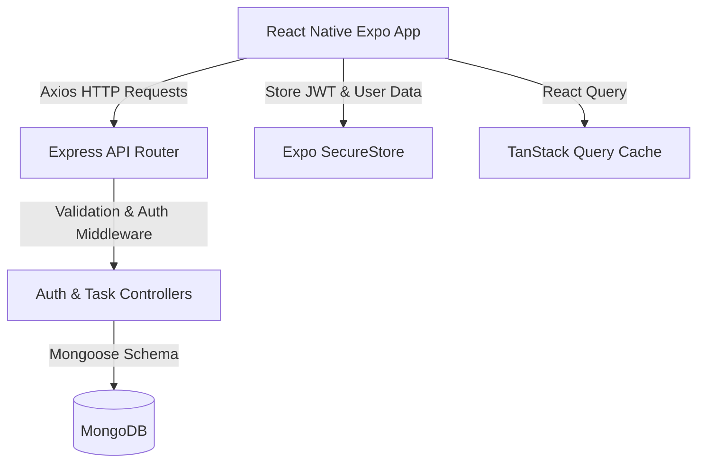
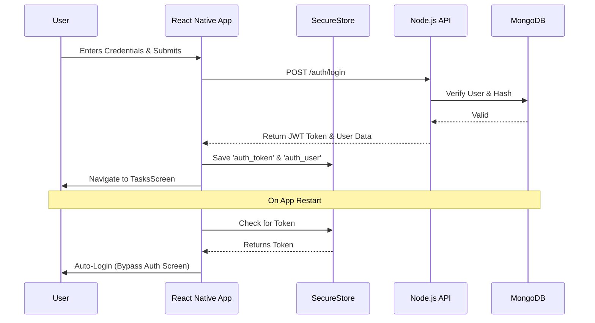

# 🚀 Task Tracker

> A stunning, full-stack React Native Expo and Node.js platform to manage your tasks with seamless session persistence, strict backend validation, and a beautiful Glassmorphism UI.


---

## 🔗 Live Links & Demo

- **🎥 YouTube Demo:** [Watch Here](https://youtu.be/-JULBI92yqU) 
- **📱 Frontend App Live:** [Expo Go Link](https://expo.dev/accounts/adityarauljis-organization/projects/frontend/builds/f02eb1a6-0bdb-4a06-9500-80b09501d5b9)
- **🌐 Backend API Base URL:** [API Link](https://tasktracker-backend-lrqi.onrender.com/) 

---


## ✅ Assignment Requirements Checklist

- [x] Complete Full-Stack Setup (Node.js/Express + React Native/Expo)
- [x] JWT Authentication (Signup/Login)
- [x] Persistent Login Sessions (Expo SecureStore)
- [x] Task CRUD Operations (Create, Read, Update, Delete)
- [x] Task Filtering (All, Pending, Completed)
- [x] Backend Input Validation & Error Handling
- [x] Strict Task Ownership (Users can't access others' tasks)
- [x] Professional UI/UX (Notion + Linear + Apple aesthetic)
- [x] Pull-to-refresh & Loading Skeletons
- [x] Strict TypeScript (Zero `any` types)

---

## 🏛 Architecture Diagram



---

## 🔐 Authentication Flow



---

## ✨ Full Feature List

- **Robust Authentication:** Secure Signup/Login with bcrypt password hashing.
- **Session Persistence:** Remembers user login state natively using `expo-secure-store`.
- **Global Error Handling:** Centralized API error parsing and UI banners.
- **Glassmorphism Design System:** Centralized theme (`src/theme/index.ts`) powering a Notion/Linear-like premium interface.
- **Data Synchronization:** Uses TanStack Query for instant UI invalidation and optimistic updates.
- **Pull-to-Refresh:** Standard native refreshing on the task list.
- **Micro-Animations:** Skeleton loaders with pulse animations.
- **Ownership Security:** Backend explicitly blocks unauthorized operations using Mongoose ObjectID checks and JWT payload verification.

---

## 🛠 Tech Stack

### Frontend (Mobile)
| Technology | Description |
|------------|-------------|
| **React Native (Expo)** | Cross-platform mobile framework |
| **TypeScript** | Strict typing across the app |
| **TanStack Query** | Server state management & caching |
| **Axios** | HTTP requests and JWT interceptors |
| **Expo SecureStore** | Encrypted local storage |
| **Expo Google Fonts** | Premium Inter & Playfair Display fonts |

### Backend (Server)
| Technology | Description |
|------------|-------------|
| **Node.js + Express** | High-performance REST API |
| **MongoDB + Mongoose** | NoSQL database and strict schemas |
| **JSON Web Tokens (JWT)**| Secure, stateless authentication |
| **Bcrypt.js** | Password hashing |
| **Express Validator** | Input sanitization and validation |

---

## 📂 Project Folder Structure

```text
task-tracker/
├── backend/
│   ├── src/
│   │   ├── config/          # MongoDB connection
│   │   ├── controllers/     # Route logic (auth, tasks)
│   │   ├── middleware/      # Auth & Error protection
│   │   ├── models/          # Mongoose schemas
│   │   ├── routes/          # Express routers
│   │   ├── types/           # Express Request definitions
│   │   └── index.ts         # Server entry point
│   ├── .env                 # Backend Secrets
│   └── package.json
└── frontend/
    ├── src/
    │   ├── api/             # Axios client & API endpoints
    │   ├── components/      # UI components (TaskCard, Modals, Buttons)
    │   ├── context/         # AuthProvider & Session Logic
    │   ├── hooks/           # useAuth, useTasks
    │   ├── navigation/      # Root Stack Navigator
    │   ├── screens/         # Login, Signup, Tasks
    │   ├── theme/           # Design System (Tokens, Fonts)
    │   └── types/           # TS Interfaces
    ├── App.tsx              # Main entry point & Context Providers
    ├── .env                 # API URL
    └── package.json
```

---

## 🚀 Installation & Setup

### 1. Clone the Repository
```bash
git clone https://github.com/aditya-raulji/task-tracker.git
cd task-tracker
```

### 2. Backend Setup
```bash
cd backend
npm install

# Configure Environment Variables
cp .env.example .env
# Edit .env and insert your MONGODB_URI and JWT_SECRET

# Start the server
npm run dev
```

### 3. Frontend Setup
```bash
cd ../frontend
npm install

# Configure Environment Variables
# Create a .env file and point to your machine's IPv4 address
echo "EXPO_PUBLIC_API_URL=http://<YOUR_IP_ADDRESS>:5000" > .env

# Start the Expo App
npx expo start
```
*Press `a` to open in Android Emulator, `i` for iOS Simulator, or scan the QR code with the Expo Go app on your physical device.*

---

## 🔌 API Endpoints

| Method | Route | Auth Required | Description |
|--------|-------|---------------|-------------|
| `POST` | `/auth/signup` | ❌ No | Register a new user |
| `POST` | `/auth/login` | ❌ No | Login & get JWT token |
| `GET`  | `/tasks` | 🔐 Yes | Fetch all tasks for logged-in user |
| `POST` | `/tasks` | 🔐 Yes | Create a new task |
| `PATCH`| `/tasks/:id` | 🔐 Yes | Update task details or completion status |
| `DELETE`|`/tasks/:id` | 🔐 Yes | Delete a specific task |

---

## 🔐 Environment Variables

### Backend (`backend/.env`)
```env
PORT=5000
MONGODB_URI=mongodb+srv://<user>:<password>@cluster.mongodb.net/tasktracker
JWT_SECRET=your_super_secret_jwt_string
```

### Frontend (`frontend/.env`)
```env
# Required for testing on physical devices via Expo Go
EXPO_PUBLIC_API_URL=http://192.168.1.100:5000
```

---

## 📜 Git Commit History Summary

| Commit Type | Scope | Description |
|-------------|-------|-------------|
| `feat:` | Design | Add complete Glassmorphism design system & typography |
| `feat:` | UI | Redesign all screens and components with glass UI |
| `fix:` | Types | Correct string-to-boolean props to prevent casting errors |
| `docs:` | Repo | Add comprehensive README with setup instructions |
| `feat:` | Auth | Persist login session and configure `.env` |
| `fix:` | API | Improve error handling and input validation in backend |
| `feat:` | App | Implement full TasksScreen CRUD, TanStack hooks, and Native Nav |
| `init:` | Mono | Setup backend and frontend Expo structure |

---

## 📄 License
This project is licensed under the MIT License.
